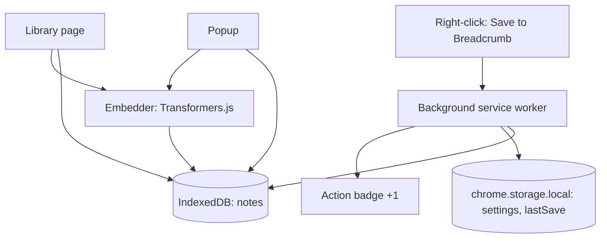

# Architecture

This document explains how **Breadcrumb** works internally.

## Design goals

1. **Least privilege** — only `storage`, `contextMenus`, and `activeTab`. No host permissions, no content scripts.
2. **Privacy** — notes live in IndexedDB on the device; nothing is uploaded.
3. **Instant capture** — saving a highlight never waits on AI or the network.
4. **Magical recall** — hybrid full-text + semantic search finds things even when you don't remember the exact words.

## Components

Capture is owned by the background worker. All reading, searching, and embedding
happens in DOM contexts (popup / library), where WebAssembly inference is
reliable and the service worker's short lifetime is not a constraint.

### Background service worker (`entrypoints/background.ts`)

- Registers the **Save to Breadcrumb** context menu (selection context).
- On click: builds a note from the selection + active tab, stores it in IndexedDB (skipping exact duplicates), records a `lastSave` hint, and flashes a `+1` badge.
- Exposes a `saveSelection` runtime message as well, so UI surfaces can capture too.

### Popup (`entrypoints/popup/`)

- Shows the just-saved note and its similar notes right after capture.
- Quick search over all notes; opens the full library in a tab.
- Kicks off embedding backfill in the background.

### Library page (`entrypoints/library/`)

- Full-width search, topic filters, and sortable note list.
- **Learning timeline** and **top topics** sidebar.
- Per-note actions: open source, find similar, delete. Plus export-JSON and clear-all.

## Data model

### `Note` (IndexedDB store `notes`, keyPath `id`)

| Field | Purpose |
|-------|---------|
| `id` | UUID |
| `text` | The highlighted text |
| `url` | Source page URL |
| `title` | Source page title |
| `createdAt` | Capture timestamp (ms) |
| `topics` | Derived topic tags for the timeline/filters |
| `embedding` | 384-dim vector, or `null` until computed |
| `embeddingModel` | Which model produced the embedding |

An index on `createdAt` supports chronological ordering.

### `ExtensionSettings` (`chrome.storage.local`)

| Setting | Default | Meaning |
|---------|---------|---------|
| `enableSemantic` | `true` | Blend semantic similarity into search |
| `semanticWeight` | `0.5` | 0 = keyword only, 1 = meaning only |
| `autoEmbed` | `true` | Backfill embeddings automatically when open |

## Capture → embed → search pipeline

1. **Capture** (`utils/note.ts`, `utils/db.ts`) — normalize text, derive topics, store immediately. Embedding is `null`.
2. **Embed** (`utils/embedder.ts`) — a DOM context lazily loads Transformers.js and backfills embeddings for notes missing one. Runs in a loop with progress; a hard failure falls back gracefully to full-text.
3. **Search** (`utils/search.ts`) — see below.

## Hybrid search (`utils/search.ts`)

For a query:

1. **Full-text pass** (`fullTextScore`) scores each note by term matches across text/title/topics/host, with field boosts and an exact-phrase bonus. This runs instantly and needs no model.
2. **Semantic pass** embeds the query on-device and computes cosine similarity against each note's embedding.
3. Scores are normalized and blended: `score = (1 - w)·textNorm + w·semanticNorm`, where `w = semanticWeight`. Semantic-only matches above a floor still surface, so you find notes by *meaning* when keywords miss.

`findSimilar` powers the "similar notes" view using embedding cosine similarity, with a keyword-overlap fallback when embeddings aren't ready.

## Topics & timeline

- `utils/topics.ts` maps recognized tokens/aliases (e.g. `k8s`, `hpa` → **Kubernetes**) and source hosts to canonical topics, with a most-frequent-keyword fallback.
- `utils/timeline.ts` buckets notes by month and aggregates topic counts, producing the reverse-chronological learning timeline.

## Security & privacy considerations

- **No host permissions / no content scripts** — the extension never runs in web pages.
- **`activeTab` only** — the tab's title/URL is read solely when you invoke the menu.
- **Local storage only** — IndexedDB + `chrome.storage.local`.
- **On-device inference** — embeddings run in WebAssembly. The WASM runtime is **bundled in the package** (`public/ort/`, copied from `onnxruntime-web` at build time by `scripts/sync-ort-wasm.mjs`); only the model weights (data) download once and cache. No user content is sent to any server.
- **No remote code** — all JavaScript **and** the WebAssembly runtime ship in the package; nothing executable is loaded from a CDN. `utils/embedder.ts` points `env.backends.onnx.wasm.wasmPaths` at the packaged runtime.
- **WASM CSP** — `content_security_policy.extension_pages` adds `'wasm-unsafe-eval'` so ONNX Runtime can execute the local WebAssembly.

## Build system

[WXT](https://wxt.dev/) generates `manifest.json` from `wxt.config.ts` and
file-based entrypoints. Transformers.js is loaded via dynamic `import()`, so it is
code-split into its own chunk and only downloaded when embeddings are used.

## Tests

Pure logic is covered by Vitest in `tests/` (node environment):

- tokenization, snippets, and highlighting (`text`)
- vector math and cosine similarity (`similarity`)
- full-text scoring, hybrid ranking, and similar-notes (`search`)
- topic derivation (`topics`), timeline aggregation (`timeline`)
- note creation/normalization (`note`)

IndexedDB, Chrome APIs, and the embedding model are thin wrappers around this
tested logic.
