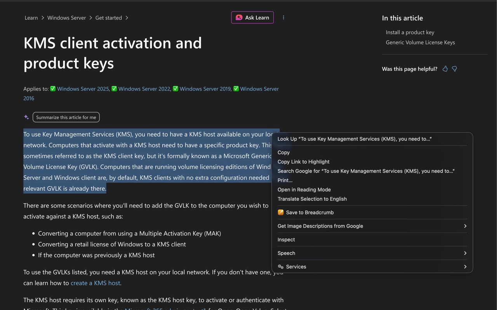
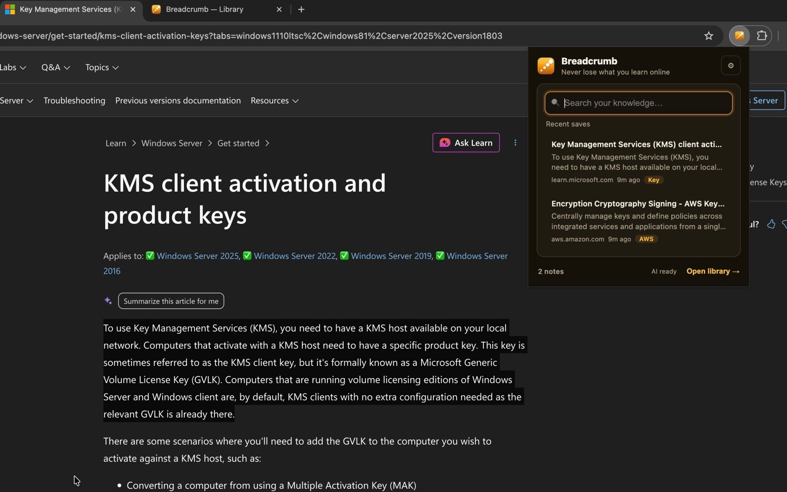
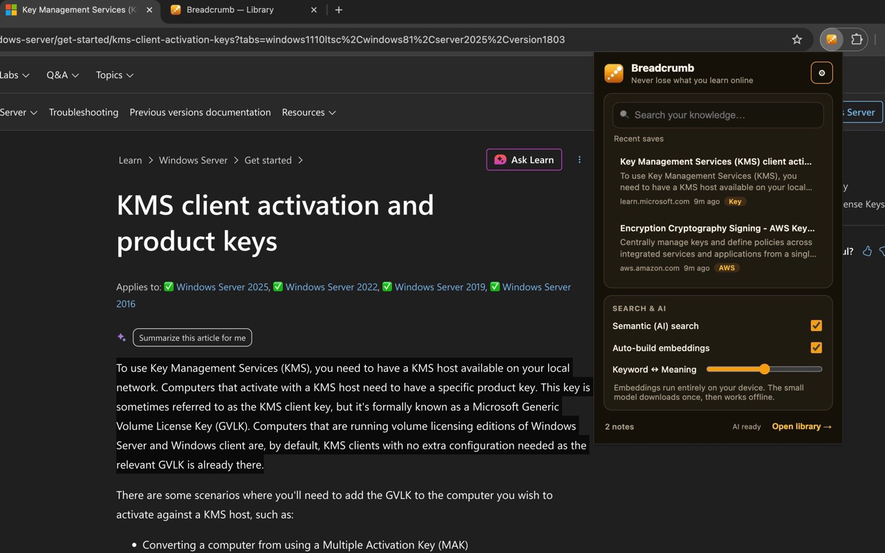
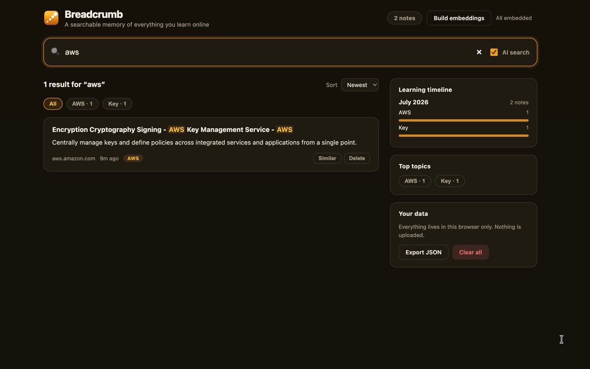

# How to use Breadcrumb

Save what you read online. Find it again later with a simple search.

## 1. Save a highlight

Read any page. Select the text you want to keep. Right-click and choose **Save to Breadcrumb**.

Breadcrumb saves the text, page title, link, and time — all on your device.

## 2. Open the popup

Click the Breadcrumb icon in your toolbar. Your recent saves show up right away. Search from here, or click **Open library** for the full view.

Turn on **Semantic (AI) search** in settings if you want meaning-based search, not just keywords. The AI runs on your device — nothing is uploaded.

## 3. Search your library

In the library, type what you remember — like `aws` or `kubernetes autoscaling`. Breadcrumb finds matching notes even if you don't recall the exact words.

Use filters and tags to narrow results. The timeline on the right shows what you've been learning over time.

---

**That's it.** Highlight → save → search. Your notes stay in your browser only.
